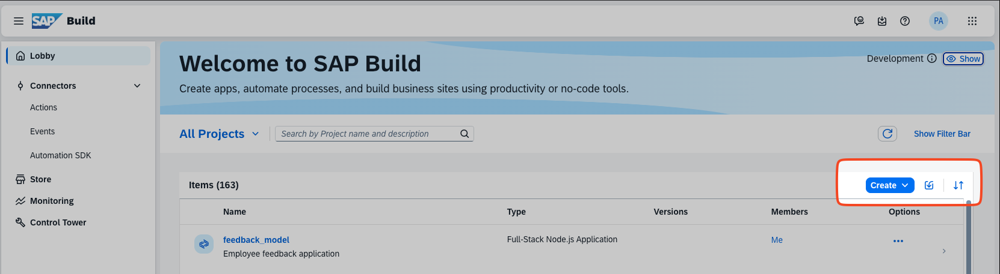

# Exercise 01 - Set Up Your Workspace

In this exercise, you'll set up your SAP Build workspace. No prior knowledge of SuccessFactors or SAP Build required.

## Log In to SAP Build

Use the credentials provided by your instructor:
- SAP Build subscription URL
- Username and password

You can replicate these exercises in your own environment anytime after the workshop.

## Create Your Project

1. In the projects area, click **Create** from the dropdown

   

2. Configure your project:
   - **Objective:** Application
   - **Category:** Full-Stack
   - **Type:** Full-Stack Node.JS
   - **Project Details:**
     - **Name:** `feedback_<username>`
     - **Description:** Employee feedback application
     - **Dev Space:** Full_Stack

3. Click **Review and Create**

The project status will show "pending" for a minute or two, then change to "ready."

## Open Your Dev Space

Click the project hyperlink to open it in your Dev Space. The project Storyboard opens by default, showing external resources, data models, services, and UI applications.

## Verify CDS Installation

Open a terminal (**Terminal** → **Create New Terminal** or use the Command Palette):

```bash
cds v
```

You should see output similar to this:

```
@sap/cds: 9.4.4
@sap/cds-dk: 9.4.3
@sap/cds-compiler: 6.4.6
@sap/cds-dk (global): 9.4.3
@sap/cds-fiori: 2.1.1
@sap/cds-mtxs: 3.4.3
@cap-js/asyncapi: 1.0.3
@cap-js/db-service: 2.6.0
@cap-js/hana: 2.3.4
@cap-js/openapi: 1.2.3
@cap-js/sqlite: 2.0.4
Node.js: v22.13.1
home: /home/user/projects/feedback_model/node_modules/@sap/cds
```

> **Note:** The CDS development kit is pre-installed in "Full Stack Cloud Application" Dev Spaces in SAP Business Application Studio.

## Summary

Your environment is ready! You have:
- ✅ An SAP Build workspace
- ✅ A Full-Stack Node.js project
- ✅ CDS development kit installed

---

## Optional: Connect to BAS Remotely

Work on your BAS project from your local VS Code:

1. Install the [SAP Business Application Studio toolkit](https://marketplace.visualstudio.com/items?itemName=SAPOSS.app-studio-toolkit) extension in VS Code
2. Enter your BAS URL (format: `https://...applicationstudio.cloud.sap`)
3. Click the **Login** button next to your landscape entry
4. Authenticate in the browser when prompted
5. Click **Open in New Window** next to your landscape entry
6. Open the project folder: `/home/user/project/feedback_<username>`

You're now connected to your Dev Space from local VS Code.

## Optional: Add Remote Repository

If you want to use your own Git repository:

1. Create a new empty repository (e.g., on GitHub):
   - **Name:** `sap_build_ws_feedback`
   - Don't add README or other files

2. Copy the repository URL (e.g., `https://github.com/username/sap_build_ws_feedback`)

3. In BAS, open the **Simple Git** extension (left sidebar)

4. Add the remote repository URL

5. Enter your Git credentials when prompted (stored in `/home/user/.git-credentials`)

The Simple Git extension will automatically commit and sync changes. Check the terminal panel (Ctrl+`) to see commits via the GitLens extension.
