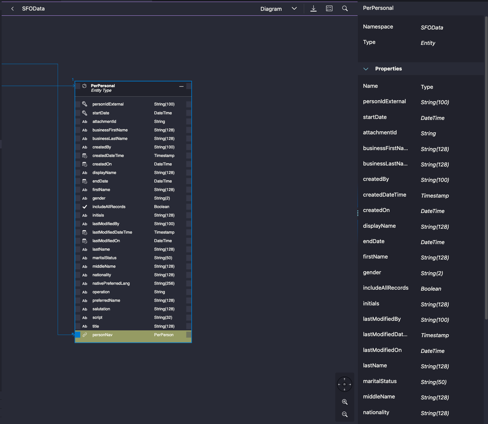

# Exercise 02 - Import External Service Definition

In this exercise, you'll connect to the SAP Business Accelerator Hub to import an external service. In your own environment, you can use the Developer Hub (part of SAP Integration Suite) to access your back-end systems securely.

You'll need your SAP Account credentials (S-User and password) to access the [SAP Business Accelerator Hub](https://api.sap.com).

## Import the Service

1. Open the Storyboard (click the Project Overview extension at the bottom of the left side panel, then click the three dots and select "Open Storyboard")

2. Click the **+** sign to add a new external resource

3. Follow these selections:
   - **Add Resource to Project:** Service
   - **Select a Provider:** SAP Business Accelerator Hub
   - **Select Product:** SAP SuccessFactors
   - **Select Packages:** SAP SuccessFactors Employee Central APIs
   - **Select Service:** Personal Information

4. Enter your SAP Business Accelerator Hub credentials when prompted

5. Add the Personal Information package to your project

## Understanding the Data Model

You'll use the **Personal Information entity** to represent Employees in the Feedback entity. Each feedback has two employee relationships: the person giving feedback (reporter) and the person receiving it (subject).

**Entity Relationship:**
```
                   ┌────────────────┐
                  1│                │
              ┌────┤   Employees    │
              │    │   (Reporter)   │
              │    └────────────────┘
             *│
┌─────────────┴──┐
│                │
│    Feedbacks   │
│                │
└─────────────┬──┘
             *│
              │    ┌────────────────┐
              │   1│                │
              └────┤   Employees    │
                   │   (Subject)    │
                   └────────────────┘
```

## Review the Imported Files

After import, you'll find two files in `srv/external`:

1. **Original metadata** (`.xml` extension) - Rename this to `.edmx` so you can view it with the OData modeler
2. **Converted metadata** (`.cds` extension) - CAP service definition

### View the EDMX File

Open `PerPersonalInformation.edmx`:
- Right-click the file → **Open With...** → **OData CSDL Modeler**
- Change the view from "General" to "Diagram" in settings

You'll see a graphical display of the entity types and relationships:



Use the search function or sidebar to locate the **PerPersonal** entity definition. The toolbar at the bottom lets you show/hide the property sheet.

### View the CDS File

Open the `.cds` file with the **CDS Graphical Modeler**. You'll use projections in later exercises to simplify this external model for your specific needs.

## Check the Configuration

The import process updates your `package.json` file. Open it and find the "cds" section:

```json
"cds": {
  "requires": {
    "PersonalInformation": {
      "kind": "odata-v2",
      "model": "srv/external/PersonalInformation",
      "[production]": {
        "credentials": {
          "path": "successfactors/odata/v2"
        }
      },
      "csrf": true,
      "csrfInBatch": true
    }
  }
}
```

This configuration tells CAP:
- **kind:** The external service is OData V2
- **model:** The service definition is in `srv/external/PersonalInformation.csn`
- **credentials:** Where to find the service in production
- **csrf:** Enable CSRF token handling

The import also adds dependencies to `package.json` - you'll explore these in later exercises.

## Summary

You've successfully imported an external service! You now have:
- ✅ SAP SuccessFactors Personal Information service imported
- ✅ External service metadata (EDMX and CDS files) in `srv/external`
- ✅ CAP configuration for external OData V2 service
- ✅ Understanding of the Employee-Feedback relationship model
