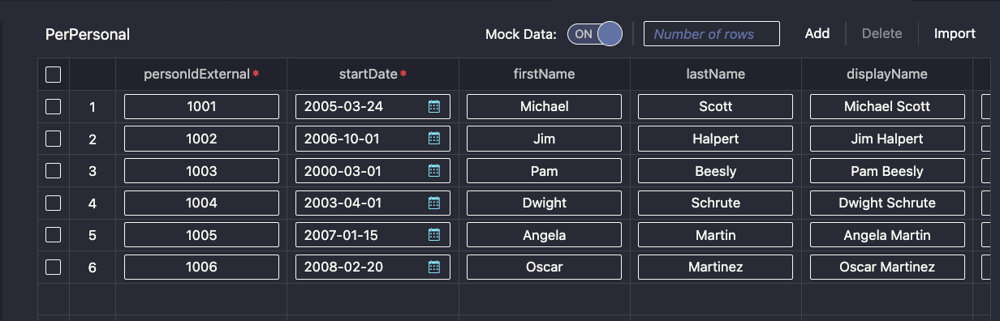
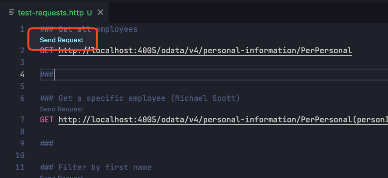

# Exercise 03 - Mock External Service

In this exercise, you'll set up a mock version of the external Personal Information service. This allows you to develop locally without connecting to live SuccessFactors systems.

## Understanding Mock Services

CAP provides built-in mocking capabilities that generate sample data based on your service definitions. This is essential for local development when external systems aren't available.

There are two approaches:
- **Embedded mocking** with `cds watch` - runs alongside your main application
- **Separate process** with `cds mock` - runs as an independent service (better for testing external integrations)

You'll use the separate process approach to better simulate real cross-service communication over HTTP.

## Start the Mock Service

In this section, you'll start the mock service and watch the service binding being created in real-time.

### Set Up Split Terminal View

1. Open a terminal (**Terminal** → **New Terminal** or **Ctrl+`**)

2. Split the terminal into two panes:
   - Click the split terminal icon in the terminal toolbar, or
   - Right-click in the terminal and select **Split Terminal**

3. In the **right pane**, start monitoring the service bindings file:
   ```bash
   watch -c jq -C . ~/.cds-services.json
   ```

   You'll initially see an error message since the file doesn't exist yet—this is expected!

### Start the Mock Service

4. Click into the **left pane** and start the mock service with a fixed port:
   ```bash
   cds mock PersonalInformation --port 4005
   ```

5. Review the output in the left pane:
   ```
   [cds] - mocking PersonalInformation {
     at: [ '/odata/v4/personal-information' ],
     decl: 'srv/external/PersonalInformation.cds:4',
     impl: 'node_modules/@sap/cds/srv/app-service.js'
   }
   [cds] - server listening on { url: 'http://localhost:4005' }
   ```

   > **Note:** Using `--port 4005` ensures a consistent port number, making it easier to write predefined test requests.

6. **Watch the right pane!** You'll see the binding appear in real-time:
   ```json
   {
     "cds": {
       "provides": {
         "PersonalInformation": {
           "endpoints": {
             "odata": "/odata/v4/personal-information"
           },
           "server": 4005
         }
       },
       "servers": {
         "4005": {
           "root": "file:///home/user/projects/feedback_model",
           "url": "http://localhost:4005"
         }
       }
     }
   }
   ```

The mock service is now running and registered in the service bindings file. The `watch` command will continue to refresh every 2 seconds, showing you any changes to the bindings.

**What's happening here?**
- CAP registers the mock service in `~/.cds-services.json` so other CAP applications can discover it
- The binding includes the service endpoint path and the server port
- This allows your main application to automatically connect to the mock service later

> ### 💡 Troubleshooting Tip
>
> The service bindings file (`~/.cds-services.json`) tracks active service bindings. If you have issues with debugging sessions or services not starting:
> 1. Stop all running processes (**Ctrl+C** in all terminals, including the `watch` command)
> 2. Remove the bindings file: `rm ~/.cds-services.json`
> 3. Restart your mock service
>
> You'll see the file disappear in the watch pane when removed, and reappear when the service restarts. This commonly happens when debugging sessions aren't gracefully terminated.

## Explore the Mock Service

1. **Ctrl+Click** the localhost URL to open the service in your browser

2. You'll see a basic landing page. Add `/odata/v4/personal-information` to the URL to view the service document

3. Add `/$metadata` to see the complete metadata document

4. Replace `/$metadata` with `/PerPersonal` to view the entity data:
   ```json
   {
     "@odata.context": "$metadata#PerPersonal",
     "value": []
   }
   ```

The `value` array is empty because no test data exists yet.

## Add Mock Data

Create sample data for development:

1. Create the data directory:
   ```bash
   mkdir -p srv/external/data
   ```

2. Create the mock data file:
   ```bash
   touch srv/external/data/PersonalInformation-PerPersonal.csv
   ```

3. Open `srv/external/data/PersonalInformation-PerPersonal.csv` and add sample employee data:
   ```csv
   personIdExternal,startDate,firstName,lastName,displayName
   1001,2005-03-24,Michael,Scott,Michael Scott
   1002,2006-10-01,Jim,Halpert,Jim Halpert
   1003,2000-03-01,Pam,Beesly,Pam Beesly
   1004,2003-04-01,Dwight,Schrute,Dwight Schrute
   1005,2007-01-15,Angela,Martin,Angela Martin
   1006,2008-02-20,Oscar,Martinez,Oscar Martinez
   ```

   > **Note:** The `startDate` field is part of the composite key (`personIdExternal` + `startDate`) for the PerPersonal entity. Even though you may not use it in your projections later, it's required for the mock service to load the CSV data correctly. Keeping all key fields aligned with the external service metadata avoids maintenance issues when the service is updated.

### 💡 Using the Visual Data Editor

Instead of manually editing CSV files, you can use the **SAP CDS Sample Data Editor** for a more user-friendly experience:

1. Right-click on the `PersonalInformation-PerPersonal.csv` file tab (or in the file explorer)
2. Select **Open With...**
3. Choose **SAP CDS Sample Data Editor**



The visual editor provides:
- **Table view** - See your data in a spreadsheet-like interface
- **Column management** - Add/remove columns with proper data types
- **Validation** - Ensures data matches the entity definition
- **Easy editing** - Click to edit cells without worrying about CSV formatting

This is especially helpful when working with entities that have many fields or when you need to maintain larger test datasets.

4. Restart the mock service:
   - Stop the current process: **Ctrl+C**
   - Start again: `cds mock PersonalInformation --port 4005`

5. Refresh your browser and navigate back to `/PerPersonal`

You'll now see the sample employees in the response with realistic data.

## Test the Mock Data

You can test the mock service using HTTP requests directly from your IDE.

### Create HTTP Test File

1. Create a test folder at the project root for organizing test requests:
   ```bash
   mkdir -p test
   ```

2. Create a new file `test/test-requests.http`

3. Add the following HTTP requests to the file:
   ```http
   ### Get all employees
   GET http://localhost:4005/odata/v4/personal-information/PerPersonal

   ###

   ### Get a specific employee (Michael Scott)
   GET http://localhost:4005/odata/v4/personal-information/PerPersonal(personIdExternal='1001',startDate=2005-03-24)

   ###

   ### Filter by first name
   GET http://localhost:4005/odata/v4/personal-information/PerPersonal?$filter=contains(firstName,'Jim')

   ###

   ### Select specific fields
   GET http://localhost:4005/odata/v4/personal-information/PerPersonal?$select=displayName,firstName,lastName

   ###

   ### Get all employees with count
   GET http://localhost:4005/odata/v4/personal-information/PerPersonal?$count=true

   ###

   ### Order by last name
   GET http://localhost:4005/odata/v4/personal-information/PerPersonal?$orderby=lastName

   ###
   ```

### Execute the Test Requests

1. With the `test-requests.http` file open, you'll see a **Send Request** link above each request



2. Click **Send Request** to execute any request

3. The response appears in a new pane showing the JSON data from the mock service

> **Note:** SAP Business Application Studio includes HTTP client capabilities by default. For VSCode users, install the **REST Client** extension by Huachao Mao for the same functionality.
>
> **Tip:** You can also use tools like Postman if you prefer a dedicated API client.

## Understanding the File Structure

The mock data file follows this naming convention:
- **Format:** `<ServiceName>-<EntityName>.csv`
- **Location:** `srv/external/data/`
- **Content:** CSV with column headers matching entity properties from the imported metadata

CAP automatically discovers and loads CSV files in this location when mocking external services.

## Why This Approach Matters

Using separate mock processes provides several advantages for HR application development:

- **Realistic integration testing** - HTTP communication like production
- **Independent service lifecycle** - Start/stop services independently
- **Network latency simulation** - Better represents real-world conditions
- **Debugging isolation** - External service issues don't affect main application

## Summary

You've successfully set up mock data for local development! You now have:
- ✅ External service running as a separate mock process
- ✅ Sample employee data with realistic HR information
- ✅ HTTP-based communication similar to production
- ✅ Understanding of CAP's mocking capabilities
- ✅ Knowledge of troubleshooting service binding issues

The mock service will serve as your external HR data source while you build the feedback application in upcoming exercises. This approach lets you develop and test locally while maintaining the same integration patterns you'll use in production.

---

**Next:** You'll create your local data model and connect it to this external employee data.