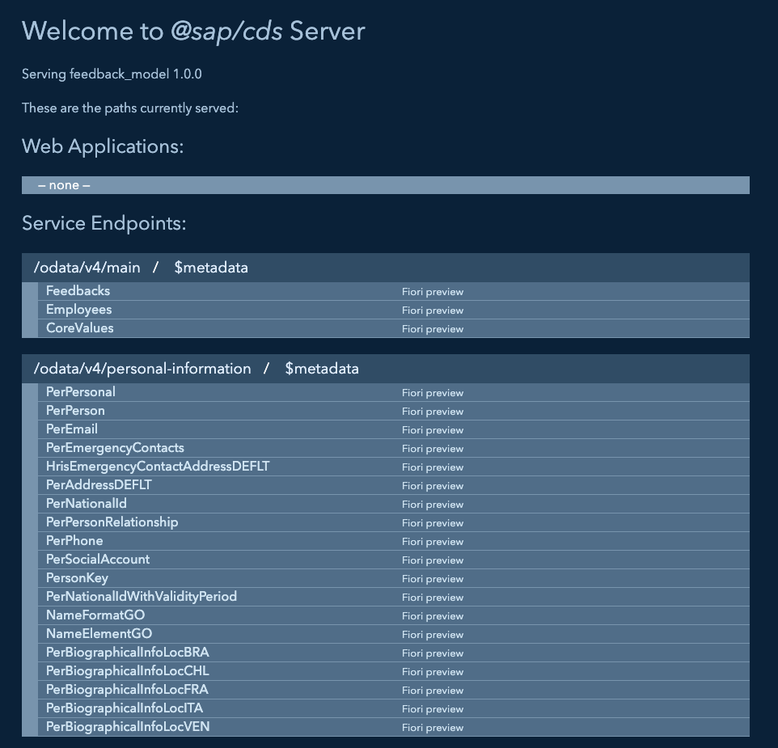
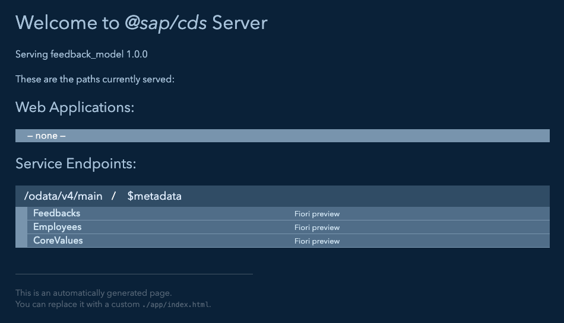

# Exercise 05 - Build Service Layer

In this exercise, you'll create the service layer that exposes your data model as OData services and add handler code to integrate with external systems. This demonstrates how CAP services orchestrate between local and external data sources.

## Create Main Service

The service layer defines what data gets exposed through OData endpoints and how clients can interact with your application.

1. Create the main service definition:
   ```bash
   touch srv/main-service.cds
   ```

2. Open `srv/main-service.cds` and add the service definition:
   ```cds
   using {data} from '../db/schema';
   using {ext} from './external';

   service MainService {
       entity Feedbacks as projection on data.model.Feedbacks;
       entity Employees as projection on ext.simple.Employees;
   }
   ```

**What this creates:**
- **MainService** - OData service accessible at `/odata/v4/main-service`
- **Feedbacks entity** - Exposes your local feedback data with full CRUD operations
- **Employees entity** - Exposes simplified SuccessFactors employee data (read-only)
- **Automatic OData features** - Filtering, sorting, pagination, and metadata

## Test Initial Service

Let's first test with CAP's automatic mocking:

1. Start the application:
   ```bash
   cds watch
   ```

2. Open your browser to `http://localhost:4004`



   You'll see both services listed:
   - **MainService** - Your main application service
   - **PersonalInformation** - Automatically mocked external service

3. Click on the **MainService** link

4. Test the **Feedbacks** entity:
   - Click on the **Feedbacks** link
   - ✅ **This works!** You'll see your local feedback data from CSV

5. Go back and test the **Employees** entity:
   - Click on the **Employees** link
   - ✅ **This works too!** You'll see employee data from the mocked CSV

**What's happening:**
- CAP automatically mocks the external `PersonalInformation` service
- Both local (Feedbacks) and external (Employees) entities work
- All data comes from CSV files for development

## Understanding the Need for Handlers

Now let's see what happens when you run services separately (closer to production):

1. Stop the current application (**Ctrl+C**)

2. Split your terminal or open a second terminal window

3. In the **first terminal**, start the external mock service:
   ```bash
   cds mock PersonalInformation --port 4005
   ```

4. In the **second terminal**, start your main application:
   ```bash
   cds watch
   ```

5. Open your browser to `http://localhost:4004`



   Now you'll see **only MainService** listed (not PersonalInformation)

6. Click on **MainService**, then test:
   - **Feedbacks** → ✅ Works (local data)
   - **Employees** → ❌ Fails with error:

```json
{
  "error": {
    "message": "Entity \"MainService.Employees\" is annotated with \"@cds.persistence.skip\" and cannot be served generically.",
    "code": "501",
    "@Common.numericSeverity": 4
  }
}
```

**Why this fails:**
- The external service is now running separately on port 4005
- Your MainService detected it via the service registry (`.cds-services.json`)
- CAP stopped auto-mocking because a real service is available
- **But** you don't have handler code to connect to that external service
- Without a handler, CAP can't serve the external entity

## Add TypeScript Support

Before writing handler code, you'll add TypeScript support for better development experience:

1. Add TypeScript to your project:
   ```bash
   cds add typescript
   ```

2. This command:
   - Installs TypeScript dependencies
   - Creates `tsconfig.json` configuration
   - Sets up type generation from your CDS models

3. Save any `.cds` file to trigger type generation. You'll see output like:
   ```
   [cds] - emitting type definitions to @cds-models/...
   ```

   This creates TypeScript type definitions from your data models, providing intellisense and type safety in your handler code.

## Create Handler Code

Now you'll create TypeScript handler code to manage the external service integration:

1. Create the handler file:
   ```bash
   touch srv/main-service.ts
   ```

2. Open `srv/main-service.ts` and add the handler implementation:
   ```typescript
   import cds from "@sap/cds";
   import { Employees } from "#cds-models/MainService";

   export class MainService extends cds.ApplicationService {
       async init() {

           const sfecService = await cds.connect.to('PersonalInformation');

           this.on('READ', Employees, (req) => {
               return sfecService.run(req.query);
           })

           return super.init();
       }
   }
   ```

**Understanding the Handler:**

### Service Class Structure
- **Extends cds.ApplicationService** - Base class for CAP service implementations
- **init() method** - Called when service starts, perfect for setup code
- **super.init()** - Must be called to complete service initialization

### External Service Connection
- **`cds.connect.to('PersonalInformation')`** - Connects to external service defined in package.json
- **Connection is cached** - CAP reuses the connection across requests
- **Automatic configuration** - Uses mock service locally, real service in production

### Event Handler Registration
- **`this.on('READ', Employees, handler)`** - Registers custom handler for READ operations on Employees entity
- **Request delegation** - `sfecService.run(req.query)` forwards the OData query to external service
- **Transparent integration** - Client doesn't know data comes from external system

### Type Safety Benefits
- **`Employees` import** - Type-safe reference to your entity definition
- **`cds.Request` typing** - IntelliSense for request properties and methods
- **Compile-time checks** - TypeScript catches errors before runtime

## Test the Complete Service

Now let's test with the handler code in place (keep both terminals running):

1. In your **second terminal** (where `cds watch` is running), restart the application:
   - Stop with **Ctrl+C**
   - Start again: `cds watch`

2. You should now see the handler implementation loaded:
   ```
   [cds] - loaded model from 6 file(s):
     srv/external/PersonalInformation.cds
     srv/external/index.cds
     srv/main-service.cds
     db/schema.cds
     ...

   [cds] - connect using bindings from: { registry: '~/.cds-services.json' }
   [cds] - connect to db > sqlite { url: ':memory:' }
   > init from db/data/data.model-CoreValues.csv
   > init from test/data/data.model-Feedbacks.csv

   [cds] - serving MainService { path: '/odata/v4/main-service', impl: 'srv/main-service.ts' }
   ```

   **Key observations:**
   - **Custom implementation** - Shows `impl: 'srv/main-service.ts'` instead of generic handler
   - **Service bindings registry** - CAP found your running mock service at port 4005
   - **Handler connection** - Your code will delegate Employees requests to the external service

3. Test again in your browser:
   - Go to `http://localhost:4004`
   - Click on **MainService**
   - Click on **Employees**
   - ✅ **Now it works!** You'll see employee data from the separate mock service

**What changed:**
- **Before handler:** CAP couldn't serve external entities → Error 501
- **After handler:** Your code delegates requests to the external service → Success

## Test Service Integration

You can also test OData query capabilities directly in your browser:

1. **Test filtering employees by first name:**
   ```
   http://localhost:4004/odata/v4/main/Employees?$filter=contains(firstName,'Jim')
   ```
   - This demonstrates that OData queries work on external data
   - The query is passed through your handler to the mock service

2. **View specific feedback records:**
   ```
   http://localhost:4004/odata/v4/main/Feedbacks?$top=2
   ```
   - Shows how OData query options work with local data
   - Try other options like `$skip`, `$orderby`, etc.

**What you've accomplished:**
- ✅ **Feedbacks** - Local data served directly from SQLite database
- ✅ **Employees** - External data delegated to mock service via handler
- ✅ **OData queries** - Filtering and other operations work on both data sources
- ✅ **Transparent integration** - Clients interact with both entities the same way

## Understanding Service Integration Patterns

### Request Flow
1. **Client sends OData request** to `/odata/v4/main/Employees`
2. **CAP routes to your handler** based on `this.on('READ', Employees, ...)`
3. **Handler delegates to external service** via `sfecService.run(req.query)`
4. **External service processes query** and returns data
5. **Handler returns data to CAP** which formats as OData response
6. **Client receives response** - appears as single, integrated service

### Benefits of This Architecture
- **Transparent integration** - Client code doesn't need to know about external services
- **Query delegation** - OData filters/sorting are passed to external systems efficiently
- **Centralized logic** - All external service interaction happens in one place

### Production Considerations
- **Authentication** - External service calls will use proper credentials in production
- **Error handling** - Add try/catch blocks for robust error handling


## Troubleshooting Service Bindings

The service bindings registry (`.cds-services.json`) is how CAP services discover each other. You can monitor it in real-time to understand what's happening.

### Monitor Service Bindings in Real-Time

For better visibility, set up three terminal windows:

1. **Terminal 1 - Service Registry Monitor:**
   ```bash
   watch -c jq -C . ~/.cds-services.json
   ```
   This continuously displays the service registry with color-coded JSON

2. **Terminal 2 - External Mock Service:**
   ```bash
   cds mock PersonalInformation --port 4005
   ```
   Watch Terminal 1 update when this starts!

3. **Terminal 3 - Main Application:**
   ```bash
   cds watch
   ```
   Watch Terminal 1 again - you'll see both services registered

**What you should see in Terminal 1:**
```json
{
  "cds": {
    "provides": {
      "PersonalInformation": {
        "endpoints": {
          "odata": "/odata/v4/personal-information"
        },
        "server": 61342
      },
      "MainService": {
        "endpoints": {
          "odata": "/odata/v4/main"
        },
        "server": 61667
      }
    },
    "servers": {
      "61342": {
        "root": "file:///home/user/projects/feedback_model",
        "url": "http://localhost:4005"
      },
      "61667": {
        "root": "file:///home/user/projects/feedback_model",
        "url": "http://localhost:4004"
      }
    }
  }
}
```

### If Services Aren't Connecting

1. **Check the registry monitor (Terminal 1):**
   - Is `PersonalInformation` showing port 4005?
   - Is `MainService` showing port 4004?
   - If not, services may not have registered properly

2. **Reset and restart:**
   - Stop all processes in Terminal 2 and 3 (**Ctrl+C**)
   - Remove bindings file: `rm ~/.cds-services.json`
   - Watch Terminal 1 - file should disappear
   - Restart mock service (Terminal 2)
   - Restart main service (Terminal 3)
   - Watch Terminal 1 populate with both services

## Summary

You've successfully created a service layer with external integration! You now have:
- ✅ MainService that exposes both local and external entities
- ✅ TypeScript handler code for external service delegation
- ✅ Working integration between local feedback data and external employee data
- ✅ Understanding of CAP's service handler patterns
- ✅ Test requests that demonstrate complete functionality

Your service layer provides a unified OData API that seamlessly combines local business data with external SuccessFactors employee information.

---

**Next:** You'll create the user interface that allows users to interact with your feedback application through forms and data displays.