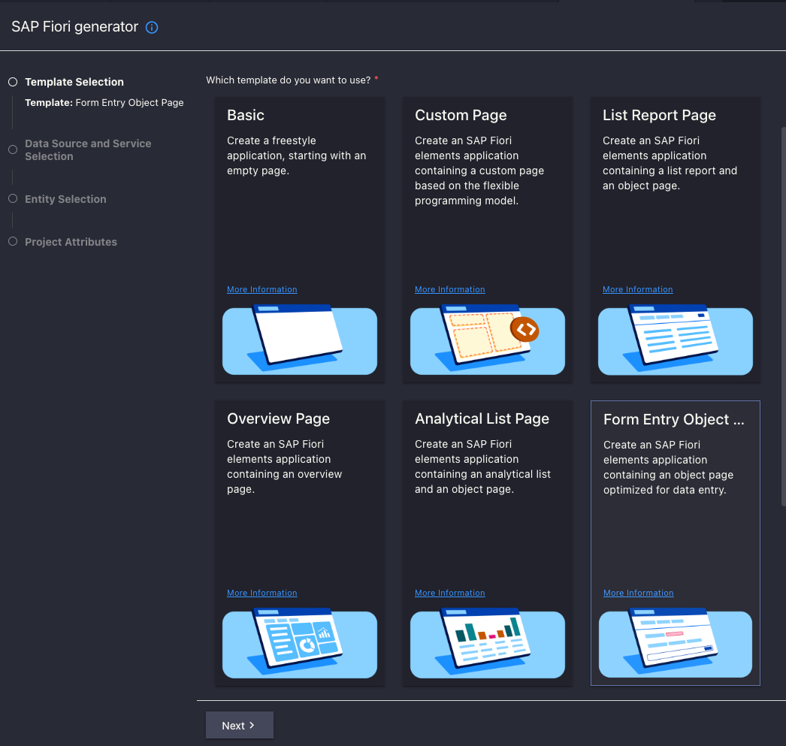
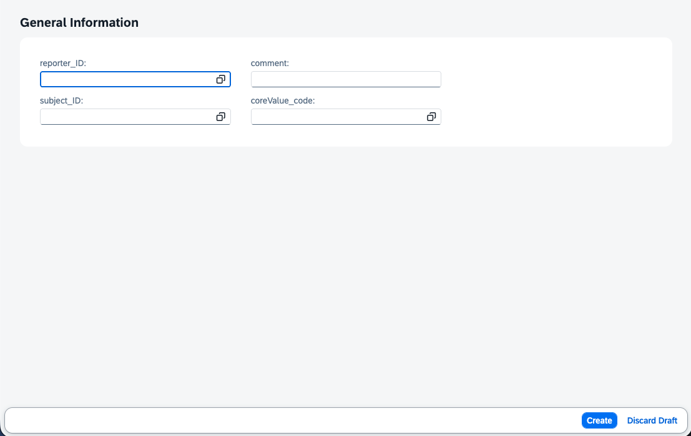

# Exercise 06 - Create User Interface

In this exercise, you'll create a Fiori Elements user interface for your feedback application. This demonstrates how to leverage SAP's UI accelerators to quickly build enterprise-grade forms with minimal custom code.

## Understanding Fiori Elements

Fiori Elements provides pre-built UI patterns that automatically generate user interfaces from your data model and service definitions. Key benefits:

- **Rapid development** - Generate complete UIs from metadata
- **Consistent UX** - Follows SAP Fiori design guidelines automatically  
- **Enterprise features** - Built-in accessibility, responsiveness, and localization
- **OData integration** - Seamless connection to CAP services
- **Extensibility** - Customize when needed without starting from scratch

## Prepare Service for UI Generation

Fiori Elements Form Entry applications require draft-enabled entities to support the edit workflow (create, save, cancel operations).

Open `srv/main-service.cds` and add the draft annotation to your Feedbacks entity:
```cds
using {data} from '../db/schema';
using {ext} from './external';

service MainService {
    @odata.draft.enabled
    entity Feedbacks as projection on data.model.Feedbacks;
    entity Employees as projection on ext.simple.Employees;
}
```

**Why draft-enabled is required:**
- **Form Entry pattern** needs to support incomplete data entry
- **Save/Cancel operations** require draft state management
- **Validation feedback** works better with draft entities
- **Multi-step workflows** can save progress incrementally

## Create Fiori Elements Application

### Open Application Generator

1. Open the Command Palette:
   - **Windows/Linux:** **Ctrl+Shift+P**
   - **Mac:** **Cmd+Shift+P**

2. Search for and select: **Fiori: Open Application Generator**

3. Choose the application template:
   - Select **Form Entry Object Page** → **Next**



   > **Note:** Form Entry is perfect for feedback collection as it focuses on data creation rather than browsing/editing existing records.

### Configure Data Source

4. **Data Source and Service Selection:**
   - **Data Source:** Use a Local CAP Project
   - **Choose a CAP Project:** `feedback_<username>` (your project name)
   - **OData Service:** MainService
   → **Next**

### Select Entity

5. **Entity Selection:**
   - **Main Entity:** Feedbacks
   - **Automatically add a form to the generated application if none already exists?** Yes
   → **Next**

### Configure Project Details

6. **Project Attributes:**

   | Field | Value | Purpose |
   |-------|-------|---------|
   | **Module name** | `providefeedback` | Folder structure and package name. Keep lowercase, no hyphens for module names. |
   | **Application title** | `Provide feedback` | User-facing title in app header and launchpad |
   | **Application namespace** | *(leave empty)* | Typically reverse domain notation for global uniqueness. For this exercise, we'll skip this. |
   | **Description** | `Provide employee feedback` | Clear business purpose |
   | **Minimum SAPUI5 Version** | `1.142.0` (or current default) | Leave default value |
   | **Enable TypeScript** | **Yes** | Type safety and better IDE support |
   | **Add SAP Fiori Launchpad Configuration** | **No** | Make sure not to select this at this time. You can always add it later. |
   | **Use Virtual Endpoints for Local Preview** | **Yes** | Enables local development |
   | **Configure Advanced Options** | **No** | Keep it simple for now |

   → **Next**

The generator will create multiple files and may take a minute to complete. Be patient while the generation runs.

## Explore Generated Files

Once generation completes, you'll see the Page Map editor. Let's understand what was created:

### Application Structure
```
app/
└── providefeedback/
    ├── webapp/
    │   ├── i18n/              # Internationalization files
    │   ├── Component.ts       # Main application component
    │   └── manifest,json.     # Application configuration
    ├── annotations.cds        # UI annotations for form layout
    └── package.json           # UI5 application dependencies
```

### Key Generated Files
- **`annotations.cds`** - Defines form layout, field labels, and UI behavior
- **`manifest.json`** - Application configuration and OData service binding
- **Page Map** - Visual editor for customizing the form layout

## Test the Basic UI

1. Start your application:
   ```bash
   cds watch
   ```

2. Open your browser to `http://localhost:4004`

3. Click on the **Fiori** link to access the Fiori preview page



4. Click on **Create Feedback** tile to launch your application

## Explore the Raw Form

You'll see a basic form with the following elements:

### What Works Automatically
- **Form structure** - Basic layout with all entity fields
- **Save/Cancel buttons** - Draft functionality working
- **Field validation** - Required fields highlighted
- **OData integration** - Reads from your service automatically

### What Needs Improvement (Exercise 07)
- **Field labels** - Show technical names instead of user-friendly labels
- **Dropdowns** - Association fields show raw IDs instead of names
- **Layout** - Fields appear in default order without grouping
- **Comment field** - Single line instead of larger text area

## Understanding the Generated Form

### Form Fields
Looking at your raw form, you'll see:
- **Reporter** - Currently shows a text input (should be employee lookup)
- **Subject** - Currently shows a text input (should be employee lookup)  
- **Comment** - Single line text field (should be larger)
- **Core Value** - Text input (should be dropdown)

### Draft Functionality
Try the following to understand draft behavior:
1. **Enter partial data** and click away - data is saved as draft automatically
2. **Click Cancel** - unsaved changes are discarded
3. **Click Save** - creates the feedback record permanently

### Data Validation
The form automatically validates:
- **Required fields** - Won't save without mandatory data
- **Data types** - Ensures proper field formats
- **Association integrity** - Validates foreign key relationships

## Test Data Creation

1. **Fill out the form** with test data:
   - **Reporter:** 1 (Michael Scott's ID)
   - **Subject:** 2 (Jim Halpert's ID)
   - **Comment:** Great work on the presentation!
   - **Core Value:** TEAM

2. **Click Save** to create the feedback record

3. **Verify creation** by checking your service directly:
   ```http
   GET http://localhost:4004/odata/v4/main-service/Feedbacks
   ```

   You should see your new feedback record in the response.

## Understanding Fiori Elements Architecture

### Metadata-Driven UI
Fiori Elements reads your service metadata to automatically generate:
- **Form fields** from entity properties
- **Field types** from CDS data types
- **Validation rules** from entity constraints
- **Navigation** from associations

### Annotation-Based Customization
The `annotations.cds` file uses UI annotations to control:
- **Field labels** and descriptions
- **Form layout** and grouping
- **Field behavior** (required, read-only, etc.)
- **Value help** and dropdowns

### Benefits Over Custom UI5
- **Faster development** - Generate instead of hand-code
- **Consistent UX** - Follows SAP design guidelines
- **Automatic features** - Accessibility, responsive design, etc.
- **Easy maintenance** - Changes to data model reflect automatically

## Summary

You've successfully created a basic Fiori Elements UI! You now have:
- ✅ Working Form Entry application for feedback creation
- ✅ Draft-enabled entity supporting save/cancel operations
- ✅ Automatic form generation from your data model
- ✅ Integration with both local and external data services
- ✅ Understanding of Fiori Elements architecture and benefits

The raw form demonstrates core functionality but needs UI enhancements for a professional user experience.

---

**Next:** You'll enhance the user interface with proper labels, improved layout, dropdowns for lookups, and branding elements to create a polished feedback application.