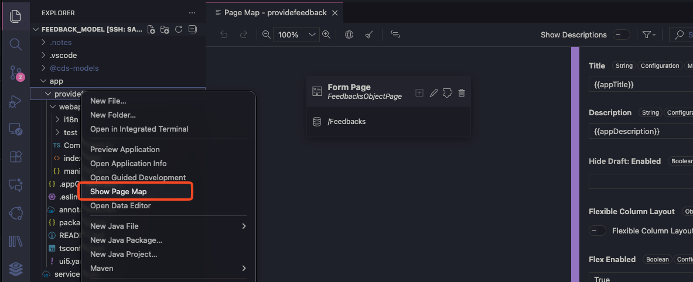
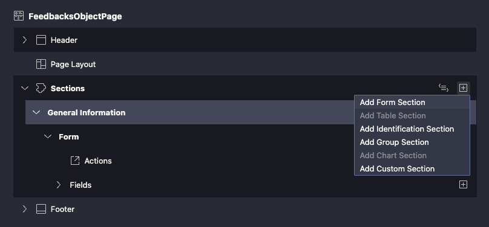
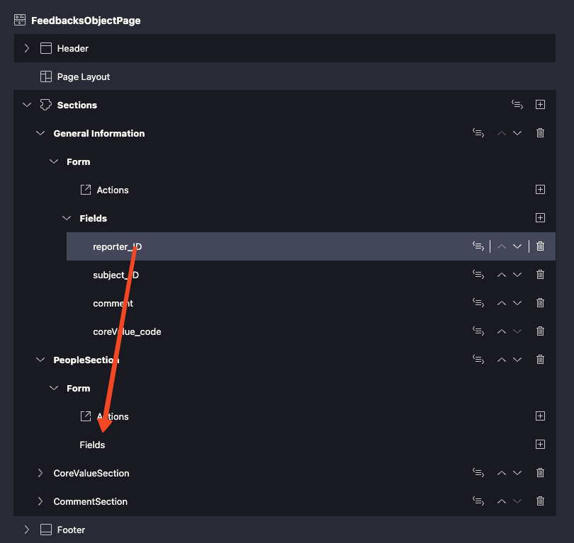
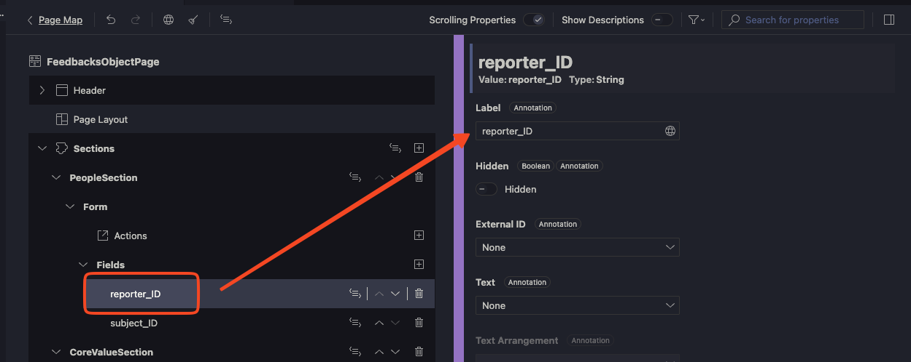
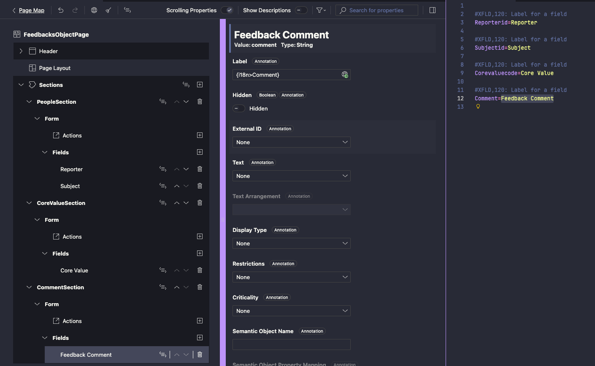
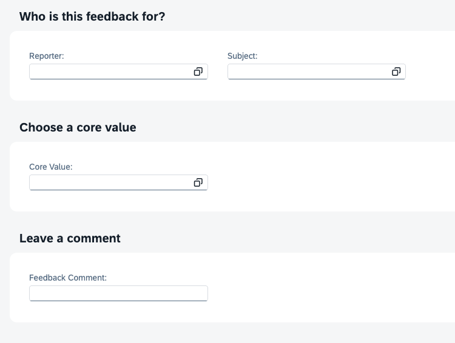
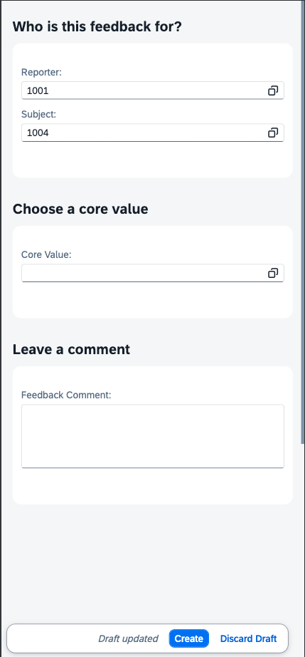
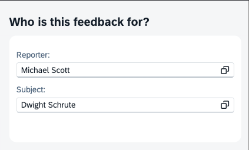
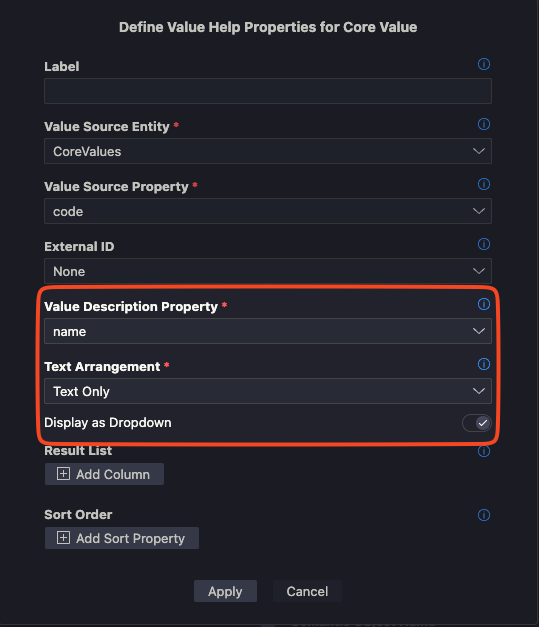
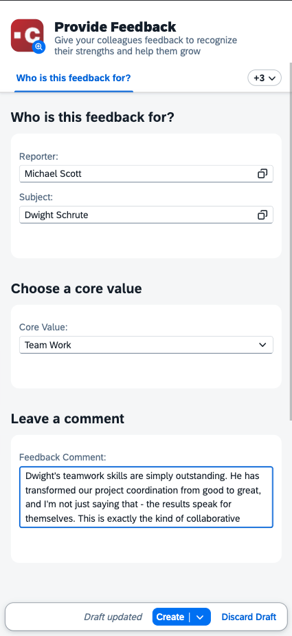

# Exercise 07 - Enhance User Interface

In this exercise, you'll transform the raw form into a professional feedback application using the Page Map editor. This visual approach allows you to enhance the UI without writing code, making it perfect for creating polished user experiences quickly.

## Open the Page Map Editor

After creating your basic Fiori Elements application in Exercise 06, you'll see the Page Map editor automatically opens. This is your visual interface for customizing the form layout and behavior.

If the Page Map editor isn't open:

1. In the Explorer panel, navigate to `app/providefeedback`
2. Right-click on the application folder (`app/providefeedback`)
3. Select **Show Page Map**



The Page Map shows your form structure visually, allowing you to customize sections, fields, and layout through a user-friendly interface.

## Step 1: Create Sections to Enhance Layout

Organizing fields into logical sections makes forms more user-friendly and visually appealing.

### Add Form Sections

1. In the Page Map editor, click the pencil to edit the form page.
1. You'll see Header, Page Layout, Sections, and Footer.
1. You'll see the existing **General Informaton** section with all fields listed together
1. Click on the **+**-sign next to the Sections and select **Add Form Section**
1. Create three new sections:
   - **PeopleSection** - For Reporter and Subject fields
   - **CoreValueSection** - For the Core Value selection
   - **CommentSection** - For the feedback comment



### Organize Fields by Section

1. **Drag and drop** fields from the default form into appropriate sections:
   - Move **reporter_ID** and **subject_ID** to **PeopleSection**
   - Move **coreValue_code** to **CoreValueSection**  
   - Move **comment** to **CommentSection**
1. **Delete** the existing **General Information** section.



**Benefits of sections:**
- **Logical grouping** - Related fields appear together
- **Visual separation** - Clear boundaries between different types of information
- **Improved navigation** - Users can focus on one section at a time
- **Responsive design** - Sections adapt to different screen sizes automatically

## Step 2: Add User-Friendly Labels

Technical field names like "reporter_ID" aren't user-friendly. You'll replace them with proper labels that users can understand.

### Enable Internationalization

1. **Click** on any field in the Page Map editor
2. Look for the **i18n icon** (🌐) next to the label field
3. **Click the i18n icon** to enable internationalization support
4. **Click "Substitute"** to convert the technical label to a translatable text key



### Customize Field Labels

1. **Click the i18n icon again** to open the translatable texts file
2. **Modify the values** to use proper labels:
   - `reporter_ID` → **"Reporter"**
   - `subject_ID` → **"Subject"** 
   - `coreValue_code` → **"Core Value"**
   - `comment` → **"Feedback Comment"**



### Add Section Titles

1. Select each section in the Page Map
2. **Add section titles**:
   - **PeopleSection** → **"Who is this feedback for?"**
   - **CoreValueSection** → **"Choose a core value"**
   - **CommentSection** → **"Leave a comment"**



**Why use i18n (internationalization):**
- **Multi-language support** - Easy to translate later
- **Consistent labeling** - Centralized text management
- **Professional appearance** - Proper capitalization and spacing
- **Maintenance friendly** - Change labels in one place

## Step 3: Make the Comment Box Larger

Single-line text inputs aren't suitable for feedback comments. You'll convert it to a multi-line text area.

### Configure Text Area

1. **Select** the "Leave a comment" field in the Page Map editor
2. In the **Properties panel** on the right, look for **Display Type**
3. **Select** the **Text Area** option

This change makes the comment field much more suitable for longer feedback text, encouraging users to provide detailed, meaningful feedback.



The above screenshot was made using the iPhone settings in the web developer tools. This shows an example of the responsive design as part of the Fiori application.

## Step 4: Show Text Instead of Technical Codes

Currently, the Reporter and Subject fields show technical IDs (like "1001", "1004") instead of employee names. You'll configure them to display meaningful text.

### Configure Text Arrangement

For both Reporter and Subject fields:

1. **Select** the field in the Page Map editor
2. In **Properties**, find **Text** settings
3. **Configure** the text display:
   - **Text Property**: Choose `displayName` from the associated Employee entity (reporter or subject)
   - **Text Arrangement**: Select **Text Only** to show the name prominently



**Result**: Instead of seeing "1001" and "1004", users will see "Michael Scott" and "Dwight Schrute" making the form much more intuitive.

## Step 5: Make Core Values a Dropdown

Transform the Core Value field from a text input into a dropdown with predefined options.

### Configure Value List

1. **Select** the Core Value field in Page Map
2. **Navigate** to the **Display Type** configuration
3. Click **Edit Properties for Value Help** and do the following
   - Select "name" as Value Description Property
   - Select "Text Only" as the Text Arrangement
   - Enable the "Display as Dropdown" option.
4. **Text** - `coreValue/name`
5. **Text Arrangement** - "Text Only"



**Benefits of dropdown:**
- **Guided selection** - Users pick from valid options only
- **Data consistency** - Prevents typos and invalid entries
- **Better UX** - No need to remember valid values
- **Validation** - Automatic validation of selected values

## Step 6: Add a Custom Header

Create a professional header with branding elements to make your application stand out.

### Make Header Visible

1. **Select** the page header in Page Map
1. Set **Visible** to true

### Configure Header Content

Create a folder to hold the icon `mkdir -p app/providefeedback/webapp/ext/fragment/img`. 
You can use the following [image](assets/feedback_icon.svg) to download and drop into the folder you just created.

Next, maintain the header properties as follows.

1. **Icon URL** - `ext/fragment/img/feedback_icon.svg`
1. **Description Type**: Change to "Text"
2. **Enter Description**: "Give your colleagues feedback to recognize their strengths and help them grow"
3. **Title**: Click on the code icon next to the field to enter annotation in the code editor. Add the "Title" section as shown below.

```
UI.HeaderInfo : {
        TypeImageUrl : 'ext/fragment/img/feedback_icon.svg',
        TypeName : '',
        TypeNamePlural : '',
        Description : {
            $Type : 'UI.DataField',
            Value : 'Give your colleagues feedback to recognize their strengths and help them grow',
        },
        Title: {
            $Type: 'UI.DataField',
            Value: 'Provide Feedback'
        }
    },
```

### Final Header Configuration

Your completed header should show:
- **Custom icon** - Visual element
- **Professional title** - "Provide Feedback" 
- **Descriptive subtitle** - Explains the application's value
- **Consistent branding** - Matches your organization's style



## Test the Enhanced UI

1. **Start** your application, if not already running.
   ```bash
   cds watch
   ```

2. **Open** the landing page: `http://localhost:4004`

3. **Click** **Web Applications** → **/providefeedback/index.html**

### Verify All Improvements

You should now see the completely transformed form:

#### ✅ Professional Layout
- **Three distinct sections** with clear titles
- **"Who is this feedback for?"** - Reporter and Subject fields
- **"Choose a core value"** - Core value dropdown
- **"Leave a comment"** - Large text area

#### ✅ User-Friendly Labels
- **"Reporter"** instead of "reporter_ID"
- **"Subject"** instead of "subject_ID"
- **"Core Value"** instead of "coreValue_code"
- **"Feedback Comment"** instead of "comment"

#### ✅ Enhanced Field Behavior
- **Employee names** displayed instead of technical IDs
- **Core Value dropdown** with predefined options
- **Multi-line comment** field for detailed feedback
- **Professional header** with custom branding

### Create Test Feedback

Fill out the enhanced form:

```
Reporter: [Select from list - shows names like "Michael Scott"]  
Subject: [Select from list - shows names like "Dwight Schrute"]
Core Value: [Dropdown - shows options like "Team Work"]
Comment: [Large text area for detailed feedback - Dwight's teamwork skills are simply outstanding. He has transformed our project coordination from good to great, and I'm not just saying that - the results speak for themselves. This is exactly the kind of collaborative leadership we need more of.]
```

**Click Save** and verify the feedback is created successfully.

## Key Takeaways

The Page Map editor demonstrates visual, low-code development with SAP Build Code:
- **No annotation coding required** - Drag-and-drop interface generates enterprise-grade UI configurations
- **Instant feedback** - See changes immediately as you customize the form
- **Professional output** - Automatically includes responsive design, internationalization, and accessibility

## Summary

You've successfully enhanced your feedback application with:

- ✅ **Organized sections** for logical field grouping
- ✅ **User-friendly labels** using internationalization
- ✅ **Multi-line comment field** for detailed feedback
- ✅ **Employee name displays** instead of technical IDs
- ✅ **Core values dropdown** with predefined options
- ✅ **Custom branded header** with icon and description

The visual approach accelerates UI development while maintaining enterprise quality standards.

---
